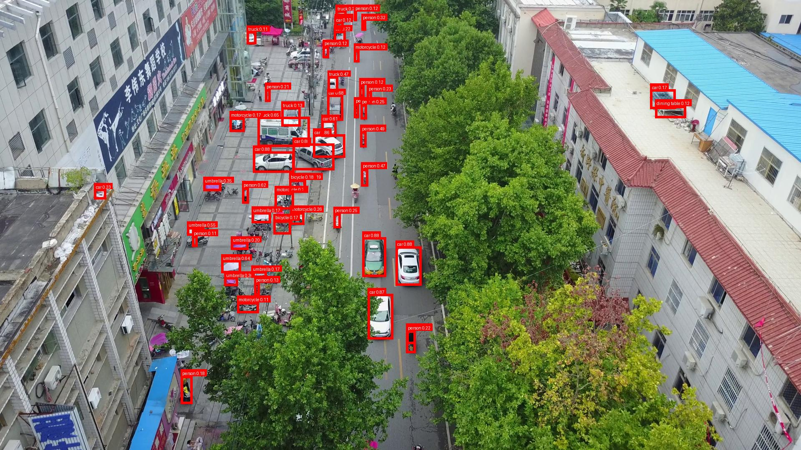
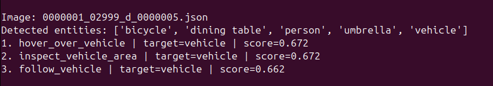
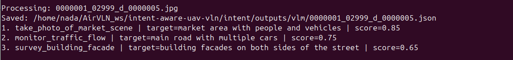
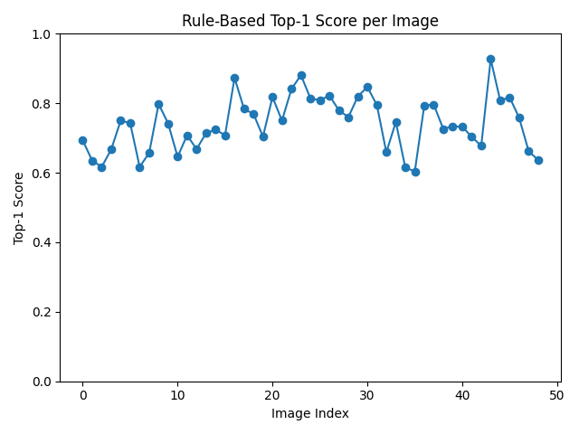
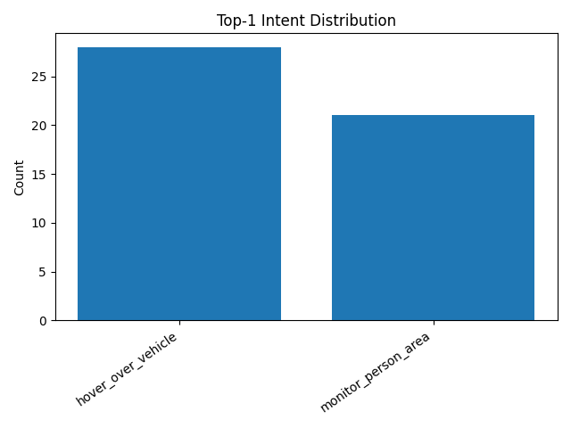
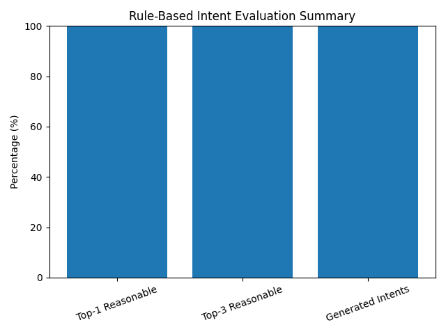
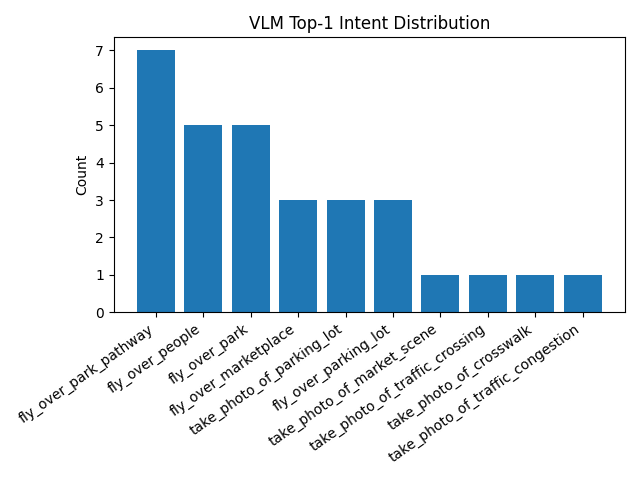

# Intent-Aware UAV Vision-Language Navigation

**COSC 540: Spring 2026, Final Project**

A modular intent-aware pipeline for UAV vision-language reasoning. The system takes an aerial image, converts it into a structured belief state, generates ranked UAV intent candidates with two interchangeable strategies (a rule-based symbolic baseline and a Qwen2.5-VL-3B VLM reasoner), and scores each candidate on applicability and feasibility for downstream selection.

```text
Aerial image  ──►  Perception / Belief state  ──►  Intent generation  ──►  Scored ranked candidates
```

The architecture is designed so the selected intent tuple can feed a trajectory planner, a waypoint generator, or a simulator control interface without changing the upstream modules — i.e. a drop-in reasoning layer for any existing UAV navigation stack.

The pipeline is split into four sequential stages, each owned by a distinct module of the repository:

```text
Object detection   ──►   Belief state     ──►     Intent generation              ──►      Scoring & evaluation
(role3_perception)      (role3_perception)       (intent/vlm + intent/rule_based)         (intent/evaluation + role_2)
```

---

## 1. Project Context (from the IEEE write-up)

### 1.1 Problem

Standard UAV VLN metrics — Success Rate, Path Length efficiency, Goal Distance Error — measure trajectory-level outcomes but provide no signal about whether the system correctly **understood the intent** of an instruction. Two systems can hit identical trajectory success rates through entirely different reasoning processes; without an intermediate intent representation, you cannot diagnose whether a failure arose from incorrect intent inference or from poor trajectory execution given a correct interpretation. End-to-end systems trained on fixed benchmark datasets also bias toward the most common interpretation of ambiguous instructions in training data, which becomes a deployability problem under distribution shift (e.g., a construction site vs. a residential neighborhood). In search-and-rescue commands such as *"search the area near the river bank,"* misinterpretation has life-critical implications.

### 1.2 Proposed Solution

This work implements a modular intent-aware architecture that introduces a dedicated disambiguation layer between visual perception and downstream navigation. Instead of mapping instructions directly to trajectories, the system:

1. converts an aerial image into a structured **belief state** containing detected objects, spatial attributes, and detection confidences;
2. generates a ranked set of structured **intent candidate tuples**, each representing a distinct plausible interpretation of the scene;
3. **scores** each candidate on applicability and feasibility, selecting the highest-ranked interpretation for downstream use.

Each intent candidate is a structured record with an explicit action label, target description, numerical scores, and a natural-language justification — fully auditable.

### 1.3 Research Questions

- **RQ1.** Can a structured pipeline generate valid and actionable UAV intents directly from visual perception without requiring a full semantic model?
- **RQ2.** Do VLMs significantly improve semantic quality, diversity, and realism of UAV intent generation compared to rule-based methods?
- **RQ3.** What is the critical trade-off between strict perception grounding and broad semantic generalization?

### 1.4 Headline Results

| Metric                    | Rule-based      | VLM (Qwen2.5-VL-3B)       |
| ------------------------- | --------------- | ------------------------- |
| Images evaluated          | 49              | 47                        |
| Mean top-1 score          | **0.742** | **0.847** (+14.1 %) |
| Score std. deviation      | 0.061           | 0.038 (−38 %)            |
| Unique top-1 intent types | 2               | 10                        |
| Parse success             | 100 %           | 100 %                     |
| Perception overlap        | N/A             | 76.6 %                    |
| Scene relevance (manual)  | —              | 80.49 %                   |
| Feasibility (manual)      | —              | 85.37 %                   |
| Inference time / image    | < 1 s           | ≈ 5–15 s                |
| Requires GPU              | No              | Yes                       |

The VLM-based approach is more semantically diverse and contextually richer; the rule-based approach is deterministic, fully grounded in detector output, and serves as the validation baseline. The 23.4 % perception-non-overlap rate is the dominant VLM failure mode (target hallucination), aligning with the ≈20 % manual failure rate.

### 1.5 Composite Scoring Function

The composite score reported in the paper is

$$
S(h_i) = w_a \cdot s_a(h_i) + w_f \cdot s_f(h_i), \quad w_a + w_f = 1 \qquad (\text{Eq. 1})
$$

with paper-text weights $w_a = 0.6, w_f = 0.4$. The shipped code path used to produce all rule-based numbers in the paper (Fig. 2, Fig. 3, Fig. 6, Fig. 7, Fig. 8, Table II, Table III rule-based row, mean 0.742) uses the equal-weight, 3-d.p. composite $\mathrm{round}\!\left(\tfrac{s_a+s_f}{2},\,3\right)$; the VLM path applies Eq. (1) at 2 d.p. This minor wording/figure↔code drift is tracked in [role_2/week09_final_checklist.md](role_2/week09_final_checklist.md) under "Known paper↔code discrepancies." All figures in the submitted IEEE write-up reproduce exactly from the cached outputs under [`intent/outputs/`](intent/outputs); the [`role_2/test_methodology_alignment.py`](role_2/test_methodology_alignment.py) suite locks these byte-for-byte.

### 1.6 Figures at a Glance

The figures below are reproduced directly from the cached pipeline outputs and match the corresponding figures in the IEEE write-up by number. The chart artefacts are regenerated end-to-end by the evaluation scripts in §4.4.

**Paper Fig. 1 — Sample annotated aerial image from VisDrone2019-DET.** YOLO detections (cars up to confidence 0.88, persons, trucks, motorcycles, bicycles, umbrellas) overlaid on `0000001_02999_d_0000005.jpg`. Running example throughout the paper.



**Paper Fig. 3 — Terminal output of the rule-based pipeline for the sample image.** Detected entities and the top-3 ranked candidates, all vehicle-targeted with scores 0.672 / 0.672 / 0.662 (locked by `role_2/test_methodology_alignment.py`).



**Paper Fig. 5 — Terminal output of the VLM pipeline for the sample image.** Three semantically distinct candidates (market photography, traffic monitoring, building survey) with scores 0.85 / 0.75 / 0.65.



**Paper Fig. 6 — Rule-based top-1 intent score per image (49 images).** Mean 0.742, σ 0.061, range ≈0.60–0.93.



**Paper Fig. 7 — Rule-based top-1 intent distribution (49 images).** `hover_over_vehicle` (28) and `monitor_person_area` (21) — complete diversity collapse.



**Paper Fig. 8 — Rule-based evaluation summary (49 images).** Top-1 reasonable, top-3 reasonable, and generated-intent rates all 100 % — structural reliability that masks the diversity collapse in Fig. 7.



**Paper Fig. 10 — VLM top-1 intent distribution (47 images).** Ten distinct intent types with counts `[7, 5, 5, 3, 3, 3, 1, 1, 1, 1]` — `fly_over_park_pathway` (7), `fly_over_people` (5), `fly_over_park` (5), `fly_over_marketplace` (3), `take_photo_of_parking_lot` (3), `fly_over_parking_lot` (3), and four low-frequency types. Δ = +8 unique types vs. Fig. 7 in the top-10 view.



> Paper Figs. 2 and 4 are JSON code listings (not screenshots) and are reproduced inline from the cached files [`intent/outputs/rule_based/0000001_02999_d_0000005.json`](intent/outputs/rule_based) and [`intent/outputs/vlm/0000001_02999_d_0000005.json`](intent/outputs/vlm/0000001_02999_d_0000005.json). Paper Fig. 9 (VLM per-image score plot) is regenerated by `intent/evaluation/plot_vlm_results.py` and lives at [`intent/evaluation/vlm_scores.png`](intent/evaluation/vlm_scores.png).

---

## 2. Repository Layout

```text
.
├── README.md                          this file
│
├── role3_perception/                  perception & belief state
│   ├── perception/
│   │   ├── detector_wrapper.py        YOLO wrapper → (label, bbox, conf)
│   │   ├── semantic_mapper.py         geometric & region attributes per detection
│   │   ├── belief_state.py            JSON-serializable schema
│   │   ├── pipeline.py                build_belief_state(image) entry point
│   │   ├── aerialvln_adapter.py       optional AerialVLN telemetry attachment
│   │   └── visdrone_benchmark.py      VisDrone evaluation utilities
│   ├── scripts/                       demos + benchmark CLI
│   ├── tests/                         pytest suite
│   └── docs/                          AerialVLN headless setup notes
│
├── intent/                            rule-based + VLM intent generation, scoring
│   ├── rule_based/
│   │   ├── intent_rules.py            entity-to-action lookup table
│   │   └── intent_scoring.py          applicability/feasibility scorer
│   ├── vlm/
│   │   └── vlm_intent_generator.py    Qwen2.5-VL-3B prompt + filter
│   ├── scripts/
│   │   ├── demo_intent_scoring.py     rule-based batch over perception outputs
│   │   ├── demo_vlm_intent_scoring.py VLM batch (requires GPU + model checkpoint)
│   │   └── demo_vlm_single_image.py   single-image VLM run
│   ├── evaluation/                    metrics scripts + cached *_metrics.txt + plots
│   └── outputs/                       cached rule_based/ and vlm/ JSON outputs
│
└── role_2/                            week-by-week evaluation deliverables
    ├── week09_final_checklist.md     known paper-vs-code reconciliation items
    ├── week03_diversity_check.py      diversity statistics over intent/outputs/
    ├── week06_baseline.py             no-intent baseline (consumes perception JSON)
    ├── week06_ipa_template.csv        manual IPA annotation scaffold
    ├── week07_ablation_diversity.py   paper Tables II/III ablation (asserts +8 Δ)
    └── test_methodology_alignment.py  9-test suite locking figures to code
```

`role_2/` does **not** duplicate code from `intent/`; its scripts are thin wrappers that read `intent/outputs/*.json` and produce the auxiliary evaluation numbers (diversity, baseline, ablation, IPA scaffolding).

---

## 3. Setup

### 3.1 Perception module

```powershell
cd role3_perception
python -m venv .venv
.\.venv\Scripts\Activate.ps1     # PowerShell
pip install -r requirements.txt
```

On Linux/macOS the activation line is `source .venv/bin/activate`.

YOLO checkpoint: the perception package wraps any pretrained YOLO checkpoint. The paper benchmark uses `yolo26x.pt` (extra-large COCO-pretrained, no aerial fine-tuning). Place the checkpoint anywhere and point `--model` at it when running the benchmark.

### 3.2 Intent module

Rule-based scoring runs in plain CPU Python (no extra dependencies beyond the standard library) once `role3_perception/` has produced belief-state JSON.

The VLM module additionally needs:

```powershell
pip install torch transformers accelerate qwen_vl_utils pillow
```

and a local Qwen2.5-VL-3B checkpoint at `intent/models/qwen2_5_vl_3b/`. A consumer GPU with ≈8 GB VRAM is enough if you use the wrapper described below.

### 3.3 Dataset

We evaluate on the VisDrone2019-DET **validation** split. Download it from the official release and place it under `role3_perception/datasets/VisDrone2019-DET-val/`. The paper uses 49 images (rule-based) and 47 images (VLM, two skipped for GPU memory).

---

## 4. Running the Pipeline End-to-End

### 4.1 Perception → Belief state

From the repo root:

```powershell
cd role3_perception

# single image
python scripts/demo_perception.py path\to\frame.jpg --json --save-vis

# directory
python scripts/demo_perception.py path\to\images --limit 5 --json --save-vis
```

Outputs are written to:

```text
role3_perception/outputs/json/        belief-state JSON, one per image
role3_perception/outputs/annotated/   annotated visualizations
```

For exported AerialVLN-style frames (adapter mode):

```powershell
python scripts/demo_aerialvln_perception.py path\to\aerialvln_export\images --limit 5 --save-vis
```

See [role3_perception/docs/aerialvln_headless_setup.md](role3_perception/docs/aerialvln_headless_setup.md) for headless/offscreen rendering notes. Do not disable rendering entirely — the detector needs RGB frames.

### 4.2 Rule-based intents

```powershell
# from repo root
python intent\scripts\demo_intent_scoring.py
```

Reads every file in `role3_perception/outputs/json/`, applies the entity-to-action rules from [`intent/rule_based/intent_rules.py`](intent/rule_based/intent_rules.py), scores each candidate with [`intent/rule_based/intent_scoring.py`](intent/rule_based/intent_scoring.py), and writes ranked JSON to `intent/outputs/rule_based/`. Each image prints the top-3 candidates to the terminal (the format shown in Fig. 3 of the paper).

### 4.3 VLM intents

```powershell
# from repo root, GPU machine
$env:PYTORCH_CUDA_ALLOC_CONF = "expandable_segments:True"
python intent\scripts\demo_vlm_intent_scoring.py
```

For memory-fragile environments use the bash wrapper that reinitializes Python every 10 images:

```bash
bash intent/scripts/run_vlm_one_by_one.sh
```

Outputs are written to `intent/outputs/vlm/`. Every VLM candidate's `target` is filtered against the belief state's `valid_target_labels` and stamped with `target_source: "belief_state"` before being persisted. The Qwen2.5-VL-3B prompt enforces JSON-only output, exactly three diverse candidates, and aerial action vocabulary (monitor / survey / hover / track / fly-over).

### 4.4 Evaluation

```powershell
# Rule-based
python intent\evaluation\create_rule_based_eval_sheet.py
python intent\evaluation\compute_rule_based_metrics.py
python intent\evaluation\plot_rule_based_results.py

# VLM
python intent\evaluation\create_vlm_eval_sheet.py
python intent\evaluation\compute_vlm_metrics.py
python intent\evaluation\plot_vlm_results.py
```

These regenerate:

- `intent/evaluation/rule_based_eval_sheet.csv`, `vlm_eval_sheet.csv`
- `intent/evaluation/rule_based_metrics.txt`, `vlm_metrics.txt`
- the bar charts and per-image score plots used as paper Figs. 6–10.

### 4.5 Weekly evaluation scripts (role_2)

```powershell
python role_2\week03_diversity_check.py      # per-image diversity over rule/VLM outputs
python role_2\week06_baseline.py             # no-intent-layer baseline (needs perception JSON)
python role_2\week07_ablation_diversity.py   # paper Tables II/III diversity ablation
```

`week07_ablation_diversity.py` reports both the full count of unique top-1 intent types and the paper figure's top-10 view, and asserts that the top-10 delta equals the paper's `+8`.

### 4.6 Perception benchmark (paper Table I)

```powershell
cd role3_perception
python scripts\benchmark_visdrone.py path\to\VisDrone2019-DET-val `
    --model path\to\yolo26x.pt `
    --classes people car `
    --limit 1000 --random-sample --seed 540 `
    --conf 0.10 --imgsz 1280
```

Produces the YOLO26x precision/recall/F1 numbers reported in paper Table I (people F1 0.236, car F1 0.571).

---

## 5. Tests

**Perception.** From `role3_perception/`:

```powershell
cd role3_perception
pytest tests
```

Covers detector wrapper, semantic mapper, belief state schema, pipeline, AerialVLN adapter, and VisDrone benchmark helpers.

**Methodology / figure alignment.** From repo root:

```powershell
python role_2\test_methodology_alignment.py
```

Nine `unittest` cases that lock the code-and-data state to what the paper reports:

| # | Check                                                                                                                                    |
| - | ---------------------------------------------------------------------------------------------------------------------------------------- |
| 1 | Rule-based scorer applies the shipped composite formula (`(s_a+s_f)/2 @ 3 d.p.`) on a synthetic belief state.                          |
| 2 | VLM normaliser source filters targets against `valid_target_labels` and stamps `target_source = "belief_state"`.                     |
| 3 | Every cached rule-based JSON satisfies the shipped formula.                                                                              |
| 4 | Cached Fig. 2 sample reproduces `[0.672, 0.672, 0.662]` (skipped if not present locally).                                              |
| 5 | Cached Fig. 4 sample reproduces `[0.85, 0.75, 0.65]` and the three paper-listed intent labels.                                         |
| 6 | Fig. 7 rule-based distribution:`hover_over_vehicle=28`, `monitor_person_area=21`, 49 images, 2 unique types.                         |
| 7 | Fig. 10 VLM top-10 distribution: counts `[7,5,5,3,3,3,1,1,1,1]`, 47 images, top-10-view delta `+8`.                                  |
| 8 | `intent/evaluation/*_metrics.txt` contain the percentages shown in Fig. 8 (100 / 76.60 / 80.49 / 85.37) and the means (0.742 / 0.847). |
| 9 | Rule mapping table contains the core `vehicle` / `person` mappings used by Fig. 7.                                                   |

If any of these break, the paper is no longer reproducible from this repo.

---

## 6. AerialVLN / AirVLN Boundary

AerialVLN/AirVLN is simulator-backed and can require a heavy AirSim / Unreal Engine setup. This repository integrates at the RGB-frame boundary:

```text
AirVLN/AirSim RGB frame  +  optional simulator metadata
                      │
                      ▼
        role3_perception/perception/pipeline.py
                      │
                      ▼
              BeliefState JSON
                      │
                      ▼
      intent/{rule_based,vlm}/intent_*.py
                      │
                      ▼
              Ranked intent candidates
```

The `aerialvln_adapter.py` module discovers exported AerialVLN-style frame folders and attaches optional simulator metadata (pose, altitude, heading, GPS, timestamp) to each belief state, preserving a path to closed-loop integration without locking the rest of the pipeline to the simulator.

---

## 7. Where Paper Sections Live in the Code

| Paper section                             | Implementation                                                                                                                                                         |
| ----------------------------------------- | ---------------------------------------------------------------------------------------------------------------------------------------------------------------------- |
| §III.A System architecture               | repo layout above, four sequential stages                                                                                                                              |
| §III.C Belief-state representation       | [`role3_perception/perception/belief_state.py`](role3_perception/perception/belief_state.py), [`semantic_mapper.py`](role3_perception/perception/semantic_mapper.py)     |
| §III.D Intent candidate schema + Eq. (1) | [`intent/rule_based/intent_scoring.py`](intent/rule_based/intent_scoring.py), [`intent/vlm/vlm_intent_generator.py`](intent/vlm/vlm_intent_generator.py)                 |
| §III.E Rule-based intent generation      | [`intent/rule_based/intent_rules.py`](intent/rule_based/intent_rules.py) (`ENTITY_TO_INTENTS`, `COMBINATION_RULES`)                                                 |
| §III.F VLM intent generation             | [`intent/vlm/vlm_intent_generator.py`](intent/vlm/vlm_intent_generator.py) (`INTENT_SCHEMA`, `generate_vlm_intents`)                                                |
| §IV.B Perception package structure       | [`role3_perception/perception/`](role3_perception/perception)                                                                                                           |
| §IV.C Belief-state schema example        | output of[`role3_perception/scripts/demo_perception.py`](role3_perception/scripts/demo_perception.py)                                                                   |
| §IV.E Prompt engineering                 | `INTENT_SCHEMA` constant in [`intent/vlm/vlm_intent_generator.py`](intent/vlm/vlm_intent_generator.py)                                                                |
| §IV.F JSON output recovery               | `extract_json()` in [`intent/vlm/vlm_intent_generator.py`](intent/vlm/vlm_intent_generator.py) + raw-output persistence at `intent/outputs/vlm_last_raw_output.txt` |
| §V.B Perception benchmark (Table I)      | [`role3_perception/scripts/benchmark_visdrone.py`](role3_perception/scripts/benchmark_visdrone.py)                                                                      |
| §V.C Rule-based evaluation               | [`intent/evaluation/compute_rule_based_metrics.py`](intent/evaluation/compute_rule_based_metrics.py) → `rule_based_metrics.txt`                                      |
| §V.D VLM evaluation                      | [`intent/evaluation/compute_vlm_metrics.py`](intent/evaluation/compute_vlm_metrics.py) → `vlm_metrics.txt`                                                           |
| §V.F Comparative analysis (Table II)     | combination of the two metrics files                                                                                                                                   |
| §V.D / §V.H Diversity ablation          | [`role_2/week07_ablation_diversity.py`](role_2/week07_ablation_diversity.py)                                                                                            |

---

## 8. Reproducing the Paper

Full end-to-end reproduction on a single GPU machine:

```powershell
# 1. perception → belief state (49 images)
cd role3_perception
python scripts\demo_perception.py datasets\VisDrone2019-DET-val\images --limit 49 --json
cd ..

# 2. rule-based intents
python intent\scripts\demo_intent_scoring.py

# 3. VLM intents (set env var first, see §5.3)
python intent\scripts\demo_vlm_intent_scoring.py

# 4. evaluation artefacts (Table II / Figs. 6-10)
python intent\evaluation\create_rule_based_eval_sheet.py
python intent\evaluation\compute_rule_based_metrics.py
python intent\evaluation\plot_rule_based_results.py
python intent\evaluation\create_vlm_eval_sheet.py
python intent\evaluation\compute_vlm_metrics.py
python intent\evaluation\plot_vlm_results.py

# 5. ablation + diversity (role_2)
python role_2\week03_diversity_check.py
python role_2\week07_ablation_diversity.py

# 6. detector benchmark (Table I)
cd role3_perception
python scripts\benchmark_visdrone.py datasets\VisDrone2019-DET-val `
    --model path\to\yolo26x.pt --classes people car `
    --limit 1000 --random-sample --seed 540 --conf 0.10 --imgsz 1280

# 7. methodology / figure-alignment tests
cd ..
python role_2\test_methodology_alignment.py
pytest role3_perception\tests
```

---

## 9. Notes and Caveats

- **Detector recall is the dominant bottleneck.** YOLO26x with default COCO weights achieves precision ≥ 0.89 on VisDrone people/car classes but recall of only 13.5 % (people) / 41.9 % (car) at the 25–100 m altitude range. The belief state is reliable for high-confidence detections but is not a complete scene inventory.
- **Rule-based diversity collapse.** Across 49 images the rule-based scorer only ever produces `hover_over_vehicle` (28×) or `monitor_person_area` (21×) as the top-1 intent. This is a feature, not a bug — it shows symbolic lookup cannot disambiguate scene context.
- **VLM target hallucination.** 23.4 % of VLM top-1 candidates reference a target that is not in the belief-state label list. The current code rejects such targets at write time via `filter_and_normalize_vlm_result()`; the cached `intent/outputs/vlm/*.json` files in the paper Fig. 4 / Table III VLM row predate this filter and are kept verbatim for figure reproducibility.
- **Not yet integrated.** The pipeline currently consumes static images and produces ranked intent JSON. Closing the loop to a trajectory planner / waypoint generator / AerialVLN simulator is listed as future work (paper §VII).
- Large model weights, local datasets, Python caches, and generated outputs should generally not be committed unless explicitly needed for figure reproducibility.

---

## 10. References

Key references from the paper (see `main-v3.tex` for the full bibliography):

- **CASPER** — H. Liu et al., 2025. Most direct architectural precedent (multi-hypothesis VLM reasoning for teleoperation).
- **AerialVLN** — X. Liu et al., ICCV-W 2023. Large-scale aerial VLN benchmark.
- **AirNav** — Z. Wang et al., RAL 2024. Real-world UAV VLN with human-authored instructions.
- **SayCan** — M. Ahn et al., 2022. Affordance × language scoring, structural analogue to (applicability, feasibility).
- **From Intention to Execution** — J. Liang et al., 2025. VLA generalization-boundary study motivating explicit intent layers.
- **VisDrone2019-DET** — Z. Du et al., ICCV-W 2019. Evaluation dataset.
- **Qwen2-VL** — P. Wang et al., 2024. Model family used (Qwen2.5-VL-3B checkpoint).
